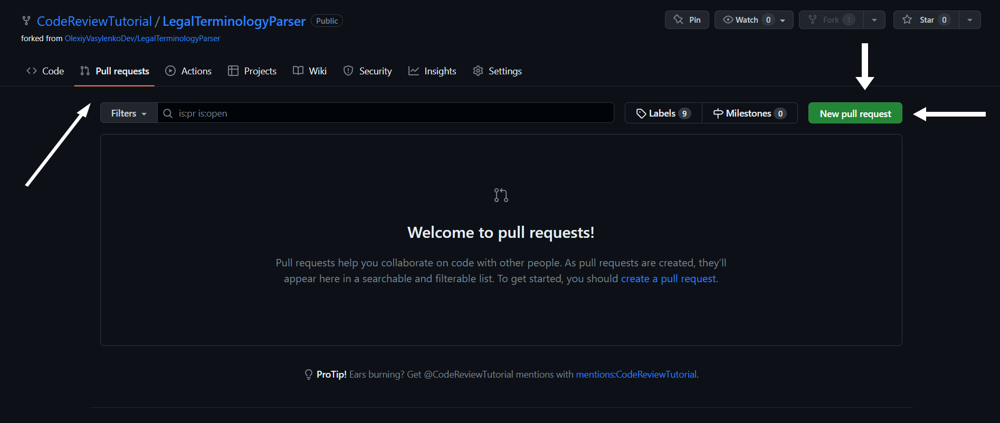
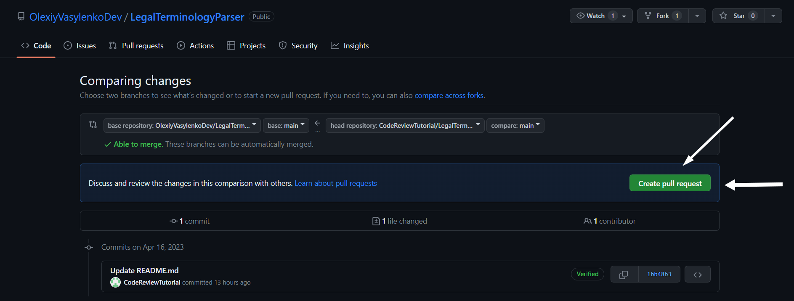
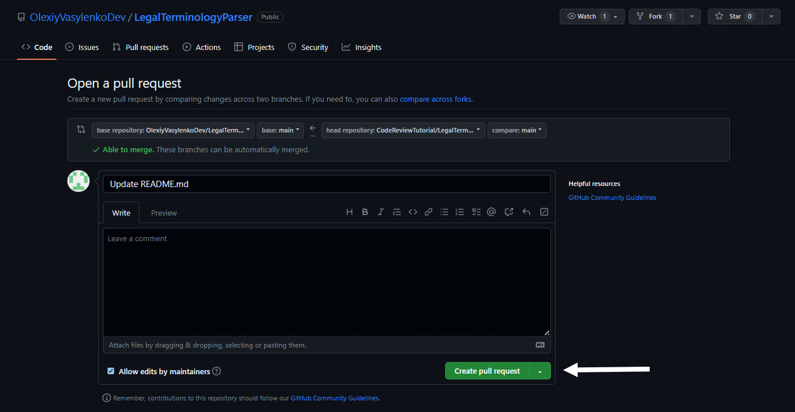

# How to work with repository
First, you need to clone the repository to your local machine by running the following command:
`git clone https://github.com/OlexiyVasylenkoDev/TestProject_Team3.git`

Before creating or committing a new feature, run the command to create a new branch. 
Try to name the branch so that it tells other users about what happens in this branch. 
Let's say, I added a new feature, in which I created animations for the home screen. 
The fine name for the branch will be 'add-animations-for-the-home-screen' and the command will look like this:
`git checkout -b add-animations-for-the-home-screen`

After you pushed new branch to repository, you need to create pull request. 
To do it, you need to click on 'Pull requests' -> 'New pull request'.

You can review the changes made in the 'Files changed' tab to ensure everything looks good. 
After that you need to click on "Create pull request" as highlighted by the arrow. 
'Compare' should be your newly-created branch and 'base' should be 'dev'. 
The only branch from which we will be creating pull requests to 'main' will be the 'dev' branch.

Once you have reviewed and filled in the necessary information such as the name of pull request and description,
click on the 'Create pull request' button again to submit your pull request for review by the repository owner or
collaborators.

